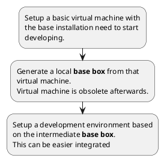

# Marvin Ros 2 Setup

Some scripts to setup virtual computers and environments to run some ROS 2 projects and tools.

The basic idea is to prepare virtual machines with different clean environments. 

## Structure

``` bash
├───bash
├───doc
├───posh
├───posh-provisioning
├───ubuntu-box-vagrant
│   ├───box-jammy-humble-robot
│   ├───box-jammy-iron-harmonic
│   └───box-noble-jazzy-harmonic
├───ubuntu-dev-vagrant
│   ├───jahuha-bot
│   ├───jahuha-sim
│   ├───jammy-humble-harmonic
│   ├───jammy-iron-harmonic
│   └───noble-jazzy-harmonic
├───ubuntu-dis-vagrant
│   └───bot-jammy-humble-harmonic
├───windows-box-vagrant
└───windows-dev-vagrant
```

## Some bash scripts

These bash scripts inf the folder *bash* are for setup certain steps in the ubuntu environment.

* setup-humble.sh: Setup the distribution *humble* as described by ROS.
* setup-iron.sh: Setup the distribution *iron* as described by ROS.
* setup-jazzy.sh: Setup the distribution *jazzy* as described by ROS.
* setup-ros2-gz-harmonic: Setup the gazebo simulation version 8 *harmonic*
* setup-workspace.sh: Setup a ROS workspace for the project.

## Vagrant environments

The vagrant environments are used to setup virtual machines with Hyper-V and vagrant on a Windows Host.
The Windows machine supports a Unix Subsystem with WSL, but sometimes a Virtual machine is easier to handle
especially when you want to test environments and get rid of all artifacts after an experiment.

### General workflow

<!-- 


System requirements are 

* Configured Hyper-V in Windows 
* Installed vagrant 
* Installed 7Zip

### base box combinations

We use some combinations for Ubuntu, ROS2 distribution and Gazebo distribution. 

See the table 

| Box Name | Ubuntu distribution | Ros distribution | gazebo Version |
|----------|---------------------|------------------|----------------|
| jammy-humble-harmonic | jammy | humble | harmonic |
| jammy-iron-harmonic | jammy | iron | harmonic |
| noble-jazzy-harmonic | noble | jazzy | harmonic |

### Supported scenarios

The supported scenarios for ubuntu can be found in the *ubuntu-dev-vagrant* folder.


| Box Name | Ubuntu distribution | Ros distribution | gazebo Version |
|----------|---------------------|------------------|----------------|
| jammy-humble-harmonic | jammy | humble | harmonic |
| jammy-iron-harmonic | jammy | iron | harmonic |
| noble-jazzy-harmonic | noble | jazzy | harmonic |

