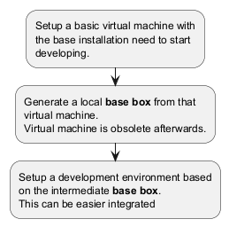

# Marvin Ros 2 Setup

Some scripts to setup computers and environments to run some ROS 2 projects.

## Some bash scripts

These bash scripts inf the folder *bash* are for setup certain steps in the environment.

* setup-humble.sh: Setup the distribution *humble* as described by ROS.
* setup-workspace.sh: Setup a ROS workspace for the project.

## Vagrant environments

The vagrant environments are used to setup virtual machines with Hyper-V and vagrant on a Windows Host.
The Windows machine supports a Unix Subsystem with WSL, but sometimes a Virtual machine is easier to handle
especially when you want to test environments and get rid of all artifacts after an experiment.

### General workflow

<!-- 
``` plantuml

@startuml

:Setup a basic virtual machine with
the base installation need to start 
developing.;
:Generate a local **base box** from that 
virtual machine.
Virtual machine is obsolete afterwards.;
:Setup a development environment based 
on the intermediate **base box**.
This can be easier iterated;

@enduml

``` -->

